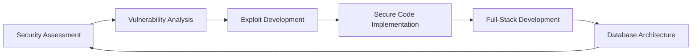

<div align="center">
  
</div>

<div align="center">
  
  
  
</div>

<br/>

---

## 🎯 About Me

```python
class LoThireach:
    def __init__(self):
        self.role = "Full-stack Developer & Cybersecurity Specialist"
        self.focus = ["Web Security", "Application Development", "Penetration Testing"]
        self.currently_learning = "Advanced Exploitation Techniques"
        self.motto = "Build secure, break securely"
    
    def say_hi(self):
        print("Thanks for dropping by! Let's build something secure together.")

me = LoThireach()
me.say_hi()
```

---

## 🛡️ Security Arsenal

<div align="center">
  
| Tool | Purpose |
|:----:|:-------:|
|  | Primary Security OS |
|  | Web Application Testing |
|  | Exploitation Framework |
|  | Network Scanning |
|  | SQL Injection Testing |
|  | Network Attacks |

</div>

---

## 💻 Development Stack

<div align="center">

### Languages & Frameworks


### Tools & Technologies


</div>

---

## 📊 GitHub Stats

<div align="center">
  
  
</div>

<div align="center">
  
</div>

---

## 🎯 What I Do

<div align="center">



</div>

**🔐 Security**
- Penetration testing and vulnerability assessments
- Security automation with Python scripts
- Network security analysis and exploitation

**💼 Development**
- Building scalable web applications with Spring Boot & Next.js
- RESTful API design and implementation
- Database design and optimization with PostgreSQL

---

## 🤝 Let's Connect

<div align="center">
  
[](https://github.com/REACH-DEL)
[](https://linkedin.com/in/lothireach)
[](mailto:your.email@example.com)

</div>

---

<div align="center">
  
  
  <br/>
  <br/>
  
  **⚡ "Security is not a product, but a process." - Bruce Schneier**
  
  <br/>
  
  
  
</div>
